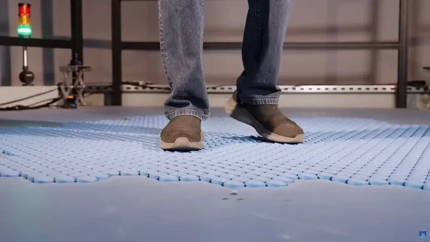

# PEC3 - Visionando el futuro con las gafas de Manovich: redescubriendo la hibridación

**Autor**: Jack Alexander Jackson  
**Asignatura**: Cultura Digital  

---

## Introducción

> “En los híbridos de medios… se unen y dan pie a nuevas *gestalts* de medios.” (Manovich, 2013)[^1]

Para Manovich, el software no es solo una herramienta: es un “motor cultural” que convierte técnicas de distintos medios en piezas que se pueden mezclar. Cuando esa mezcla es profunda, no estamos ante multimedia (poner cosas juntas), sino ante hibridación: una experiencia nueva y coherente que ya no se puede separar en “partes”.[^1][^2]

En esta PEC analizo dos casos recientes que todavía no están normalizados para el público (son prototipos/tecnologías experimentales), pero que sirven muy bien para entender el nivel 3 de Manovich:
- **Meta Orion** (prototipo de gafas de realidad aumentada)
- **Disney HoloTile Floor** (suelo omnidireccional experimental tipo “holodeck”)

---

## Re-descubriendo la hibridación con Meta Orion

Meta presentó Orion como unas gafas de realidad aumentada “de verdad”, con la idea de que la capa digital no esté en una pantalla aparte, como el móvil, sino mezclada con lo que ves delante.[^3][^4] Lo importante aquí no es solo “ver gráficos”: es el intento de crear un nuevo medio donde mirar, interactuar y moverte se vuelven parte de una misma experiencia.

Una pista clara de que hablamos de algo todavía en desarrollo es que el sistema no se reduce a “unas gafas”. En las explicaciones aparece un conjunto de piezas: gafas + un pequeño dispositivo de proceso (“compute puck”) + una pulsera para control.[^5][^6] Eso encaja con Manovich: la hibridación suele aparecer como una "plataforma" que junta varias técnicas (no como un único formato cerrado).

### ¿Dónde está la hibridación (y por qué no es solo multimedia)?
Si esto fuera multimedia, sería algo tipo “te pongo texto y vídeo encima del mundo”. En Orion, la mezcla es más profunda, porque se fusionan técnicas que antes estaban separadas:

- **Representación**: el mundo físico se convierte en “soporte” y el software coloca información/objetos de manera estable para que no se sientan como una ventana flotante cualquiera.[^3][^5]  
- **Interfaz**: Meta investiga control con pulsera usando señales musculares (sEMG/EMG). Dicho simple: sensores que detectan pequeños movimientos del cuerpo para convertirlos en acciones, sin depender solo de tocar una pantalla.[^7][^8]  
- **Estructura de sistema**: el “compute puck” existe para descargar parte del trabajo de las gafas y permitir un formato más ligero. Esto es importante porque la experiencia híbrida depende de que todo “responda” rápido y se sienta natural.[^6]

En otras palabras: Orion intenta que el usuario no sienta “estoy usando 3 aparatos”, sino un único medio donde lo digital y lo físico se funden. Esa búsqueda de coherencia es justo lo que Manovich diferencia de la multimedia clásica.[^1]

### Hibridación en la vida real: ventajas y dudas
A mí lo que me llama la atención no es “qué apps saldrán”, sino el cambio de hábito que propone: dejar de sacar el móvil para todo y pasar a un entorno donde la información aparece “en tu visión” y tú respondes con gestos o microacciones. Si saliera bien, sería un salto grande en interfaz (otra forma de navegar el medio).[^1][^7]

Pero también hay dudas razonables: si necesitas un puck y una pulsera, queda claro que todavía no es una tecnología lista para uso masivo. Por eso me parece un buen caso de hibridación “en construcción”: la idea ya existe, pero el formato final aún no está cerrado.[^5][^6]

---

## Re-descubriendo la hibridación con Disney HoloTile Floor

Disney Imagineering mostró el HoloTile Floor como un suelo modular que “se comunica contigo” para que puedas caminar en cualquier dirección sin salirte del área.[^9] Se suele explicar como “una cinta de correr en todas direcciones”, pero la gracia no es la metáfora: lo interesante es que el suelo intenta convertir el acto de caminar en una interfaz controlada por software.[^9][^10]

Aquí el caso encaja perfecto con las pautas del profesor: hibridación en interfaz (cómo interactúas) y también en la forma de “representar” un espacio (porque tu cuerpo puede moverse como si estuviera recorriendo un mundo enorme, aunque estés en una habitación).

### La hibridación aquí es corporal (y eso lo hace muy potente)
Este ejemplo me parece "muy Manovich” porque la hibridación no depende de poner pantallas bonitas, sino de fusionar:
- el medio físico (caminar / equilibrio / dirección)
- el medio digital (navegación / simulación / experiencia inmersiva)

En vez de usar botones, el cuerpo pasa a ser el mando. Y el suelo deja de ser un soporte pasivo para convertirse en un sistema que reacciona, ajusta y guía. Esto crea una experiencia nueva: no estás “viendo VR”, estás habitando una experiencia donde tu caminar forma parte del sistema.

Además, medios como WIRED lo conectan directamente con la idea del “holodeck” (un espacio que se adapta para que puedas moverte en mundos simulados).[^11] Es decir, la promesa cultural es clara: caminar infinito sin chocar con paredes.

### ¿Por qué no es multimedia?
Porque no está mezclando “contenidos” (vídeos, texto, sonido) sino técnicas: locomoción + control + sensores + seguridad + coordinación. Eso cambia la forma de navegar el medio: moverte ya no es solo “tu cuerpo en una sala”, sino una interacción entre cuerpo y software.

Y para aterrizarlo un poco: incluso existe documentación técnica (patentes) sobre sistemas de suelos con “baldosas activas” que mueven al usuario/objeto en distintas direcciones.[^12] Esto no hay que explicarlo con tecnicismos, pero ayuda a justificar que hablamos de una tecnología real que hace posible esa interfaz híbrida.

### Valoración personal
Yo lo veo como un ejemplo muy claro de cómo el software se mete en prácticas humanas básicas (andar, orientarte) y las reorganiza. Como estudiante, me parece fácil de defender porque responde a una pregunta simple: **¿qué pasa cuando caminar se convierte en un input y el espacio responde?**

A la vez, es realista pensar que no es algo “para casa” a corto plazo: requiere infraestructura, coste, mantenimiento, y seguramente se vea primero en investigación, instalaciones o experiencias controladas. Pero como caso de hibridación es muy fuerte, porque muestra un cambio de interfaz y de experiencia, no solo de formato.[^9][^11]

---

## Conclusión
Meta Orion y Disney HoloTile Floor muestran dos rutas distintas de la hibridación que describe Manovich. Orion apunta a un futuro donde la interfaz se integra en la visión cotidiana (capas digitales sobre el mundo) y donde el control se vuelve más corporal y menos “pantalla-céntrico”.[^3][^7] HoloTile, en cambio, lleva la hibridación al suelo: convierte el movimiento humano en interfaz y hace que el espacio físico sea parte activa del medio.[^9]

En ambos casos, lo relevante no es “mezclar medios” como en multimedia, sino **fusionar técnicas** para crear una experiencia nueva y coherente: justo la idea de *gestalt* que Manovich usa para diferenciar la hibridación avanzada.[^1][^2]

---

## Fuentes y bibliografía

[^1]: Manovich, L. (2013). *El software toma el mando*. Barcelona: Editorial UOC. (Cap. 3 y 5).
[^2]: Manovich, L. (2007). *Understanding Hybrid Media* (PDF). https://manovich.net/content/04-projects/056-understanding-hybrid-media/52_article_2007.pdf
[^3]: Meta. (25/09/2024). *Orion: True AR Glasses Have Arrived* (Meta Quest Blog). https://www.meta.com/blog/orion-ar-glasses-augmented-reality/
[^4]: Meta. (25/09/2024). *Introducing Orion, Our First True Augmented Reality Glasses*. https://about.fb.com/news/2024/09/introducing-orion-our-first-true-augmented-reality-glasses/
[^5]: The Verge. (25/09/2024). *Hands-on with Orion, Meta’s first pair of AR glasses*. https://www.theverge.com/24253908/meta-orion-ar-glasses-demo-mark-zuckerberg-interview
[^6]: Meta. (04/03/2025). *Orion’s Compute Puck…* https://www.meta.com/blog/orion-compute-puck-reality-labs-next-computing-platform/
[^7]: Meta. (25/09/2024). *A Look at Our Surface EMG Research…* https://www.meta.com/blog/surface-emg-wristband-electromyography-human-computer-interaction-hci/
[^8]: Meta. (23/07/2025). *New Reality Labs Research on sEMG Published in Nature*. https://www.meta.com/blog/reality-labs-surface-emg-research-nature-publication-ar-glasses-orion/
[^9]: Los Angeles Times. (31/01/2024). *HoloTile Floor, the latest invention by Disney's Lanny Smoot*. https://www.latimes.com/lifestyle/story/2024-01-31/lanny-smoot-disney-inventor-holotile-floor
[^10]: Walt Disney Imagineering (YouTube). *Disney Imagineer Lanny Smoot Demonstrates the HoloTile Floor*. https://www.youtube.com/watch?v=m3Sh6mu4zbs
[^11]: WIRED. (28/02/2024). *Meet the Disney Imagineer Building You a Real-Life Holodeck*. https://www.wired.com/story/lanny-smoot-disney-imagineer-lightsaber-holodeck/
[^12]: Google Patents. *US20180217662A1 — Floor system providing omnidirectional movement of a person…* https://patents.google.com/patent/US20180217662A1/en
